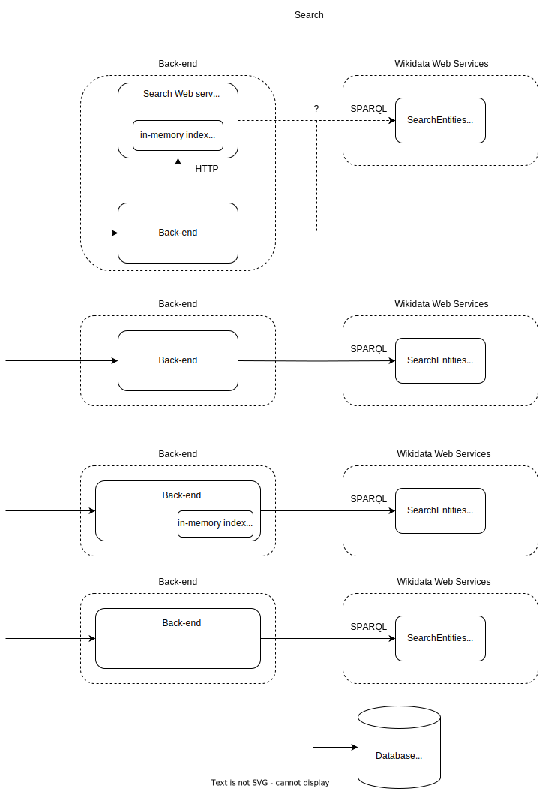

# Backend design

## API

So far only in abstraction:

- Searching for a root
  - search based on the given string:
    - search by a class name
    - search by a instance (external api)
    - search by a property
- Hierarchy and browsing (either in the root search or association search).
  - give me parents (multiple input classes)
  - give me children (multiple input classes)
  - give me entire parent hierarchy?
  - give me entire children hierarchy?
  - give me entire parent/children hierarchy at once?
- Class/es detail
    - for a given class/es return it's information:
      - attributes
      - associations
      - related classes
      - subclasses
      - names/labels/descriptions
    - the returned associations and properties
      - it should be devined into:
        - all
        - own
        - inherited
        - general
      - if returning properties, there should be some order on the returned one or recommended order.
- Property/ies detail
  -  give me details for a property including
     -  constraints
     -  wikibase type
     -  internal type: general or not 
- Recommendations
  - give me recommendations based on already made user association selection

## Design questions

- I need to provide search for the classes and properties.
    - There needs to be a query for the external api if i want to provide instances.
    - What about the search on classes and properties?
    - ideas:
        1. The search engine can be another available service.
            - The service uses internal index for available classes and properties and calls external api for the instance search.
            - pros:
              - It offloads the main backend from the search.
              - easier to maintain
            - cons:
              - it might take longer since there is additional step in the request.
              - possibly language description duplication since strings have to be in two places - index, and the main backend.
              - for the instances we need to obtain additional information - their classes, instances of instances - this needs to be propagated back to the main backend.
        2. The back end can solely rely on the external api.
           - pros:
             - There is only simple query for the search.
             - No need to create internal index
           - cons:
             - The data in the search are up to date, but we depend on the older dump.
             - It can be difficult do decide what is instance and what is not.
               - And for the instances we need to get information so we can present it. 
        3. The back end can have internal index for the full text search and additionaly query the Wikidata endpoint.
           - pros:
             - no additional service
             - the index can be queried in another thread
           - cons:
             - main-back end does all the work
        4. The back end can query the DB with full text while simultaneously query the Wikidata api.
           - pros:
             - possibly we could get the data immediately with the query
           - cons:
             - Data is not present in the backend - for hierarchical queries.

- Where to keep the data?
  - We need hierarchical queries on the parents and children.
  - With class detail and properties we need the enpoints classes as well.
  - Ideas:
    1. Everythink can be in memory:   
        - a tree for the subclass of hierarchy
        - main data of classes and properties + dealing with inherited properties
        - where to put the index of full text search?
    2. Something in db and something in memory.
       - the hierarchical structure subclass of in memory
       - ? the rest in db?
         - we get the full text search
         - is it possible to query for so many properties?
         - how to get hierarchical properties
- What technology?
  - Node, Java, Golang
  - Node
    - pros:
      - the easiest for me
      - a lot of libraries
    - cons:
      - no paralelism -> some hierarchical queries can take a long time and thus block the global interpreter log
  - Golang
    - pros:
      - easy parallelism with goroutines
    - cons:
      - don t know it much
  - Java 
    - pros
      - can have paralelism with threads and thread pool executors
    - cons
      - i feel there would a lot of boilderplate code
