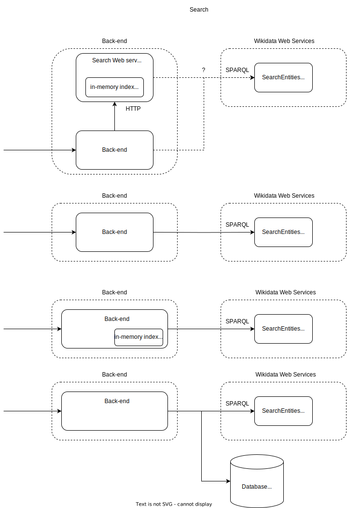

# Backend design

This file contains general questions about backend architecture and implementation.

## API

So far only in abstraction:

- Searching for a root
  - search based on the given string:
    - search by a class name
    - search by a instance (external api)
    - search by a property
- Hierarchy and browsing (either in the root search or association search).
  - give me parents
  - give me children
  - give me entire parent hierarchy?
  - give me entire children hierarchy?
  - give me entire parent/children hierarchy at once?
- Class/es detail
    - for a given class/es return it's information:
      - attributes
      - associations
        - it should be devined into:
          - all
          - own
          - inherited
          - general
        - if returning properties, there should be some order on the returned one or recommended order.
      - related classes
      - parents
      - names/labels/descriptions
- Property/ies detail
  -  give me details for a property
     -  instance of (groups)
     -  constraints
     -  wikibase type
     -  internal type: general or not 
- Recommendations
  - give me recommendations based on already made user association selection

## Design questions

- I need to provide search for the classes and properties.
    - There needs to be a query for the external api if i want to provide instances.
    - What about the search on classes and properties?
    - ideas:
        1. The search engine can be another available service.
            - The service uses internal index for available classes and properties and calls external api for the instance search.
            - pros:
              - It offloads the main backend from the search.
              - easier to maintain
            - cons:
              - it might take longer since there is additional step in the request.
              - possibly language description duplication since strings have to be in two places - index, and the main backend.
              - for the instances we need to obtain additional information - their classes, instances of instances - this needs to be propagated back to the main backend.
        2. The back end can solely rely on the external api.
           - pros:
             - There is only simple query for the search.
             - No need to create internal index
           - cons:
             - The data in the search are up to date, but we depend on the older dump.
             - It can be difficult do decide what is instance and what is not.
               - And for the instances we need to get information so we can present it.
             - The search mostly returns instances 
        3. The back end can have internal index for the full text search and additionaly query the Wikidata endpoint.
           - pros:
             - no additional service
             - the index can be queried in another thread
           - cons:
             - main-back end does all the work
        4. The back end can query the DB with full text while simultaneously query the Wikidata api.
           - pros:
             - possibly we could get the data immediately with the query
           - cons:
             - Data is not present in the backend - for hierarchical queries.

- Where to keep the data?
  - We need hierarchical queries on the parents and children.
    - access parents/children hierarchies
    - for a class detail -> somehow take into account inherited properties.
  - With class detail and properties we need the enpoints classes as well.
  - Ideas:
    1. Everythink can be in memory:   
        - a tree for the subclass of hierarchy + dealing with inherited properties (based on constraints)
        - main data of classes and properties
        - where to put the index of full text search?
    2. Something in db and something in memory.
       - the hierarchical structure subclass of in memory
       - ? the rest in db
         - we get the full text search
         - is it possible to query for so many properties?
         - how to manage hierarchical queries
- What technology?
  - Node, Java, Golang
  - Node
    - pros:
      - the easiest for me
      - a lot of libraries
    - cons:
      - no paralelism -> some hierarchical queries can take a long time and thus block the global interpreter log
  - Golang
    - pros:
      - easy parallelism with goroutines
    - cons:
      - don t know it much
  - Java 
    - pros
      - can have paralelism with threads and thread pool executors
    - cons
      - i feel there would a lot of boilderplate code

