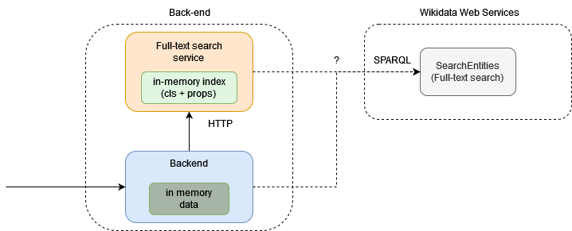

# Server-v1

For the first verion of the backend I chose a combination of Elastic search (as search service) and Node js backend.

## Search service

- Elastic search contains aliases and labels of entities.
  - There can be also descriptions but upon testing I decided to exclude the descriptions since they somehow destroyed the anticipated results.

## Node js backend

- All data will be in the memory and will query the search service and wd search service for the instances.

## Notes for the v2

- I wonder how it would look if the search was done solely by the wikidata search service.