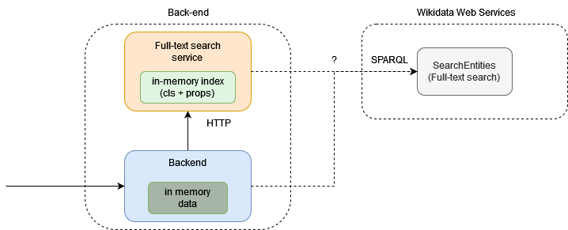

# Server-v1

For the first verion of the backend I chose a combination of Elastic search (as search service) and Node js backend.

## Search service

- Elastic search contains aliases and labels of entities.
  - There can be also descriptions but upon testing I decided to exclude the descriptions since they somehow destroyed the anticipated results.
- For searching I chose `multi_match` query to include all fields in the input objects.
- For the internal query type of the `multi_match` I produce two separate queries: `phrase_prefix` and `best_fields`.
  - The two types are there because they mostly complement each other.
  - The only problem is the sorting of the results, since one of the types has usually the hiegher scores and out-scores the other, even thought the other can have better results semantically.
  - Maybe it would be a good idea to include the search based on the wikidata search api?
    - not sparql but the php api

- One problem that arised from using one object in the elastic search for one entity, is that it lacks proper language support.
  - When querying it just search all fields with multiple languages.
  - Since the `phrase_prefix` and `best_fields` are used to mitigate missing classes, we could use the php api for searching entities.
    - But to do so, we need to obtain the language for quering php wikidata api.
- I solved the problem by adding additional query to the Wikidata php api for searching.
- I also modified the api of the search so that the user can use a language priority.

## Node js backend

- All data will be in the memory and will query the search service.
- Internally I use fastify, because it provides out-of-the-box validation and fast serialization, also it handles asynchronous start ups (it starts server after everything is loaded) and it can be used to generate the Open API specification (thanks to the validation and serialization schemas).
- I also changed the pipeline to remove any classes that have no label in selected languages and that recursively remove unrooted classes.
  - The unrooted classes removal was done upon notice of poluting the root entity, which thus had 22k children.
  - There are three options how to approach this problem:
    1. Remove unrooted classes 
    2. Root them forcefully to the root entity (was doing this from the start)
    3. Leave them unrooted and allow users to search for them, in Dataspecer maybe it could mean there from the owl:Thing.
  - i should keep this in check as an issue. 
- Comments for the api:
  - surroundings:
    - maybe it does not need the parents, children hierarchy?
    - I could try to make it precomputed the properties?
  - hierarchy:
    - do i need to return the children?

## Questions

1. what about the unrooted classes
2. do i need to return children refernce in hiearchy purpose?