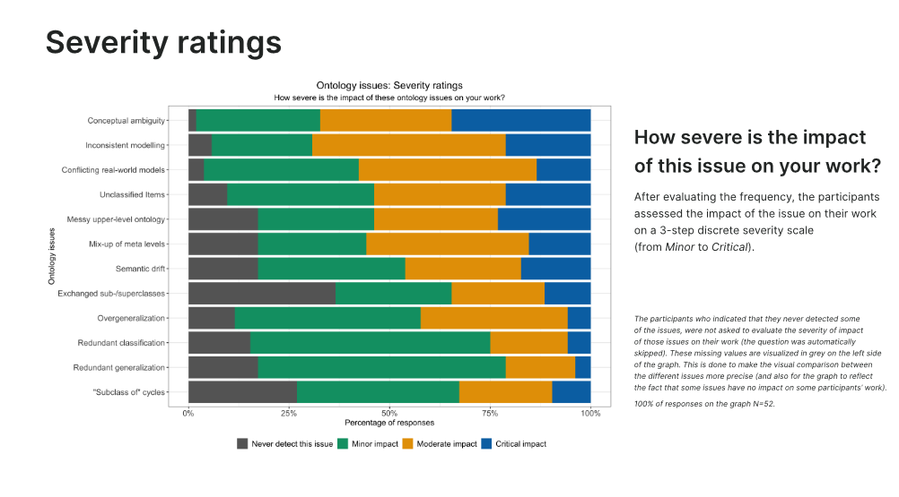

# Topics ideas

- Three main areas:
    1. Ted pracuji na nejakych castech s Wikidaty, ale nemam moznost jit v zadne casti do hloubky. Hlavni point je zde nejak vybrat veci z toho na cem pracuji a bud jit v jednom smeru do hloubky, nebo jich vzit vicero a jit vic do sirky.
    2. Mam neco, pojdme to vic do hloubky analyzovat ? tady si nejsem jisty -> vim ze necasky zminil 3 temata a to prostredni jsem zapomnel nez jsem dosel domu
    3. Pojdme zkusit to co jsme ted delali na jine Ontologii.

### First area 

1. Na zacatku jsem hodne premyslel nad vyhledavanim a dialogu pri hledani korene v dataspeceru. Bylo by zajimave to vic prozkoumat do hloubky a podivat se jak se da lepe hledat na zaklade pozadavku uzivatele. Otazka je jak propojit moznosti hledani - uzivate zada nazev tridy, instance ci property. Na pozadi prohledavani grafu.

2. Vytvoreni pipeliny na praci s Wikidaty obecne - rovnou paralelne. Mam pipeline, ktera extrahuje nejake tridy. Bylo by fajn napsat nejakou knihovnu, ktera by poskytla rozhrani pro definici veci ktere se maji stat -> design pattern pipes & filters.

3. Nejcasteji se ve Wikidatech resi tridy a hierarchie pomoci propert subclass of and instance of. Bylo by fajn se podivat taky vic z pohledu properties.
    - Otazka je jestli by to bylo neco uzitecneho, jestli vlastne to prinese neco noveho. Proc? Mame totiz uz constraints a uz se nejak provadi validace na itemech. Co vic na nich vykoukat?
    - Muzu je zkusit vic analyzovat z pohledu ontologie a trid -> idealne to nejak propasovat do prostredi dataspeceru a jak se to v nem bude chovat. 
      - To by treba mohlo zkoumat pohled uzivatele na vracene property a jak pohled ovlivni treba qualifiers a nasledne i ty conflicts with or requires statement constrainty.

4. Udelat nejake cool uzivatelske rozhrani pro prochazeni wikidati ontologie -> ale ja moc uzivatelske rozhrani nechci resit, kdyz jsem videl Adama. Ale porad je to validni napad. Nebylo by to jen tridy -> hlavne by tam slo o zobrazeni vetsi casti grafu a prochazeni pomoci properties, coz jsem zatim jeste vubec nevidel.

5. Napada me algoritmicke problemy na reseni problemu, ktere si nejak nastinili ve Wikidatech.
   1. [ontology issues](https://www.wikidata.org/wiki/File:WikidataCon_2021_-_Overview_of_ontology_issues.pdf)
   2. [ontology suggestions](https://www.wikidata.org/wiki/File:Wikidata_ontology_issues_%E2%80%94_suggestions_for_prioritisation_2023.pdf)
   - Na druhou stranu, prijde mi, ze to je ohrana pisnicka -> treba najdi cyckly v hierarchii, overgeneralization, redundant-xy.
   - Pak tam jsou ty semanticke problemy, ale prijde mi, ze resenim je udelat to nejak rucne -> sednout si a rict ze ty koncepty jsou spatne a upravit to -> to by musela delat nejaka AI.

## Second area

Tady si prave nepamatuju, o cem jsme konkretne mluvili.
Matne si pamatuji neco.

1. Napada me zde analyza kvality -> ale spis by bylo uzitecne pro komunitu Wikidat vzit si nejaky jeji issue a vyresit ho. Viz to nahore.

## Third area

1. Jako dalsi ontologie mi pripada kmani DBPedia a Yago. Ale bylo by to dostatecne velke pro DP? Jaky by v tom byl vlastne research potencial?
   - napada me spis jen porovnani pruchodu tou integraci do dataspeceru a popsat nejake hlavni rozdily a problemy -> wikidata jsou bad a yago maji byt lepsi -> ale jak se to prokaze v prostredi dataspeceru?
     - zde by mozna bylo fajn vzit wikidata a yago -> protoze yago vychazi z wikidat a ma to byt procistena verze
     - U toho yaga jsem koukal na jejich posledni clanek o yago 4.5 kde extrahuji vic veci z wikidati ontologie. Obecne u toho yaga maji upper ontology a lower ontology -> upper ontology je nejaka rucne mapovana ze schema org a lower level je z wikidati ontologie. Zatim to vypadalo, ze nejak rucne neco zmapovali a pak to automaciky zprovoznili. V tom Yagu 4.5 nejdriv vytvorili tu upper level ontology a pak vytvorili mapovani z te upper level do wikidat -> nasledne udelali "shluky" ze pod classu z upper ontology prilepili cely podstrom z wikidat. Ma to pridat vice informaci. Viz paper na jijich strankach.
   - Na druhou stranu, prijde mi, ze vlastne si ty problemy resi nejak po svem -> skoro vsechny, ktere jsem ve wikidatech videl, nevim jak bych s tim pokrocil na DP, kdybych je porovnaval.