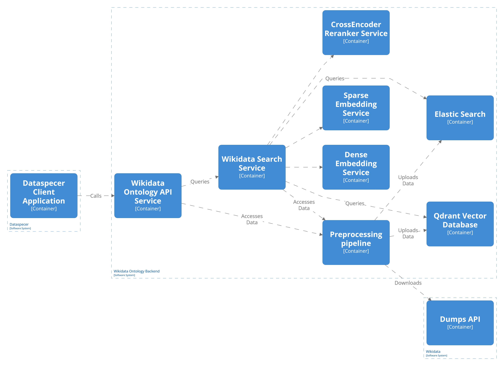

# The Wikidata ontology

We are extracting/creating ontology from the Wikidata.

- The sources are divided into three parts:
    - `preprocessing` - donwloads, extracts and creates the ontology
    - `backend` - serves as an api to the ontology 
    - `frontend` - servers as a testing ground for the api and integration into the Dataspecer tool.

How to run and use the parts, as for more in depth documentation, visit the mentioned subfolders.

## Model

The model of the Wikidata can be view [here](https://www.mediawiki.org/wiki/Wikibase/DataModel).
Everything in Wikidata is an entity, the entities are further divided into *items*, *properties*, *lexemes*, *senses* and *forms*.
We are interested only in *items* and *properties*.

### Classes

We are reusing rules for identifing classes from ([Wikidata ontology project](https://www.wikidata.org/wiki/Wikidata:WikiProject_Ontology/Modelling)):
  - The *item* has a *property* instance of (P31) with one of values equal to the metaclass of a class (Q16889133), or
  - the *item* is a value of an instance of (P31) statement in any other item, or
  - the *item* is a value of a subclass of (P279) statement in any other item, or
  - the *item* contains a subclass of (P279) statement.
  - Everything a subclass of an entity (Q35120).

We also extend this model to account only for *items*. 
Since they represent real world entities.
Meaning we are excluding lexicographical information.

- Imlicitly the classes form a subclass of hierarchy with the root as entity (Q35120). 
- We also keep the instance of information among classes (e.g. volcano is instance of a volcanic landform and subclass of a mountain).

### Properties

- [Properties](https://www.wikidata.org/wiki/Help:Properties)
    - [Property constraints](https://www.wikidata.org/wiki/Help:Property_constraints_portal)
    - [Properties by datatype](https://www.wikidata.org/wiki/Special:ListDatatypes)
    - [In depth about datatypes](https://www.wikidata.org/wiki/Help:Data_type)

Properties have datatypes (higher level type, e.g. language string, table, item, wikidata-item, wikidata-property ) and an underlying type (lower lever type, e.g. item, string, quantity).
Each property can also have assigned constraints - the constraints are not enforced or checked, so it is not a trustworthy source of information.

- We extract and use all properties except:
  - `subclass of` and `instance of`
    - Since it would cause serious memory usage during the computation of the statistics and their general usage.
  - Properties with datatype `Lexeme`, `Senses`, `Forms` 
- We further devide the properties into attributes and associations:
  - An attribute is a property with underlying type equal to the `quantity`, `string`, `geoordinates` and `time` - meaning it has a literal value.
  - An association is a property with underlying type equal to the `item` - meaning it points to an item, in our case a class.
- As for constraints, we do not enforce the constraints nor we use them (but we extract them if the need arises), except subject type and value type constraints which are used for enrichment of domains and ranges of properties.
- For associations we create domains and ranges.
  - We compute statistics of usage of properties on instances of classes.
  - Each property usage on an instance of a class can be seen as a domain/range definition.
  - For each property we note the usage of domain classes and range classes.
  - In terms of modeling it means, that our "new" association property used on an instance of our "new" class can point to any class from the ammased range of the property. Or looking at our "new" property domains, denotes that each class from the domain classes can use the property.
  - Each of the extracted domains/ranges we enrich with the Wikidata property constraints information.
- We also assume inheritance in the subclass of hierarchy - meaning properties of ancestors can be used in their subclasses.
    - This was implemented since many classes do not have any instances, thus are not domain of any property.
- Each association property has always defined a range if it has defined a domain.
- Associations are oriented edges.

> Notes:
>    - Some properties do not have a domain, thus cannot be used on any class. The api service accounts in for this.

## Architecture overview

- The architecture consists of the main three containers.
  1. Preprocessing pipeline 
      - Downloads and preprocesses Wikidata GZIP dump file.
      - The output of the pipeline are files containing Wikidata ontology as described above.
      - The pipeline also loads the ontology as a last step into an Elastic search.
      - The code and documentation is located in `preprocessing` folder.
      - The code contains a series of Python scripts for preprocessing.
  2. Wikidata ontology API service
      - Loads the created ontology into a memory and provides an API for accessing and browsing the ontology.
      - The API is modelled to fit the [Dataspecer](https://github.com/mff-uk/dataspecer) needs.
      - The code and documentation is located in `backen/wdoi-service` folder.
      - The code contains a Node.js application running with `Fastify`, and can be run inside Docker.
  3. Elastic search
      - Provides full-text search over the Wikidata ontology.
      - Assuming the Elastic Search is running somewhere inside Docker container provided by the offical source.
- To learn more about each part, visit their specific subfolders.
  - Regarding Elastic search configuration you can view documentation and usage of 6. phase of the preprocessing pipeline.

There also exists a `ds-mockup` inside `frontend` folder, which serves solely for development porposes.
Usually it is not updated frequently to match the latest API of the service.

### Dependencies 

- As of now there are dependencies between the containers.
  - The preprocessing pipeline assumes there is running an Elastic search service
    - Since the last phase of the pipeline loads the ontology into the service.
  - The Wikidata ontology API service depends on the output from the preprocessing pipeline.
    - Since the output files of the pipeline needs to be loaded into the API service.
  - The Wikidata ontology API service depends on the Elastic search service, which enables searching the ontology.

### Comments on running

- To learn how to run and set up each part you should visit their specific folder.

- **The preprocessing pipeline** - can run the entire process or each specific phase.
  - Right now, there is not a docker image support.
  - Ideally eventually, there would be a service that could run the pipeline regularly.
  - There should be running the Elastic search service, at least for the last phase.
- **The Wikidata ontology API service** - can be run "normally" or inside Docker.
  - The only problem is the dependency on the Elastic Search service, since they are separate containers, thus there is the need to create Docker `bridge` to connect the services.
  - It would be nice if it could be run as `docker-compose` eventually, but right now, the set up is using Docker `run`.
  - The problem is in the updating the indeces in the Elastic and reloading the Ontology into a memory.
    - The API service should be down when the indeces are updates, and should be restarted to reload the ontology. 
- **Elastic search** - running inside Docker.
  - More on the set up and connection can be found inside 6. phase of the pipeline or set up Wikidata ontology API service with Docker. 