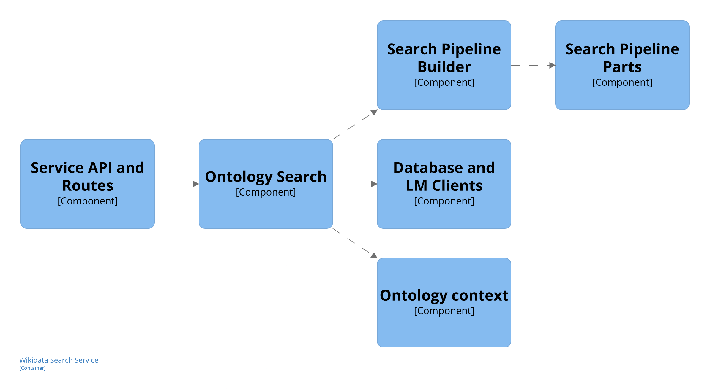

# Wdoi Search service

The service is a search service for the Wikidata ontology.
It loads the preprocessed ontology into a memory and provides a search API.
It enables to the Wdoi system to search for classes and properties.

- Structure of this readme:
  - Implementation
  - How to run the service.

# Implementation

Is implemented as Node.js server with Fastify and Typescript.

- The service is divided into 6 main components:
  1. Service API and Routes
  2. Ontology Search
  3. Ontology Context
  4. Search Pipeline Parts
  5. Search Pipeline Builder
  6. Database and LM Clients

## Service API and Routes with Fastify

- Abstractions are based on `fastify` model.
  - Everything is a plugin.
  - Working with typescript requires typings for routes and augmentations for hooks and decorators ([guide](https://fastify.dev/docs/latest/Reference/TypeScript/)).
- The server is asynchronously started by `fastify` by loading all plugins into `FastifyInstance` inside `app.ts` file.
  - Opon start up, `fastify` will initialize the `WdOntologySearch` class by loading the necessary ontology parts into memory from specified files inside environment variables.
  - Logging is configured based on development/production builds.
    - Internally it uses `pinojs` for logging.
    - During development it uses `pino-pretty`
    - In production it uses a leaner format.
- Routes are created as a plugin into `fastify`.
  - Four main routes:
    - `/documentation` serves dynamically create swagger API as a static page.
    - `/restart` enables restart of the `fastify` server, to reload a new ontology from files (assuming they got updated).
    - `/search-classes` a route for searching classes.
    - `/search-properties` a route for searching properties.
  - Each route contains a schema of the route output and input body, that is done in order to increase performance of serialization of the data and to allow typescript in the request/response.
    - Internally, it uses `fast-json-stringtify`.
    - We are using `json-schema-to-ts` as a means to write json schemas for the routes responses and requests.
    - There are [multiple ways](https://fastify.dev/docs/latest/Reference/TypeScript/) how to do it.
    - The API returns `fastify` errors when an unexisting entity is accessed.
      - For more on errors visit [docs](https://fastify.dev/docs/latest/Reference/Errors/).
- Host and ports:
  - For running inside docker, the `host` needs to be set to `0.0.0.0` otherwise the `fastify` will not connect to the outside.
  - During development, it defaults to `localhost`.
  - Port is set to `3062`.

### Restarting == Load new data

- The route `/restart` was created to enable restart of the `fastify` server which results in loading the ontology files again.
- Assuming that the files got updated, the new ontology is loaded to the server.
- The route requires a `RESTART_KEY` which authorizes the restart, since the route is exposed to the internet.
  - There are surely better ways how to secure a route.
  - For our purposes, since the restart is done only from the internal network, we deemed it sufficient for the enviroment we are presented with.

## Ontology Search

- The ontology search component is essentially represented by a `WdOntologySearch` class that provides an API for the search routes. It is sort of a `Facade` design pattern.
- The class is created upon `fastify` start up.
  - The initalization loads the ontology context (a `WdOntologyContext` class) that provides the Wikidata ontology entities during the search processes.
  - After the ontology context is loaded, it provides the search API to the routes.

## Ontology Context

- The ontology context is essentially represented by a `WdOntologyContext` class that provides the Wikidata entities to the rest of the application.
- The creation handles the loading of the ontology from the specified files inside environment variables.

  - After the loading is finished, a normalization process takes place on the ontology features.
  - We normalize every feature used for reranking to enable reranking with the scores from the candidate selectors.
  - We are using `saturation` = `x / (x + pivot)` for:

    - Class features of instance count and external ontology mappings.
    - Property features of usage on instances and external ontology mappings.
    - The idea behind the function is to provide a score between the [0, 1] interval for features. We wanted to boost classes which have a lot of instances/mappings, but the amount of classes that have instances and mappings is already low, so we did not want to create big gaps between the classes that have at least some instances/mappings since it is already a mark of relevance. So by setting the `pivot` low, we will give a similar score to the classes that have a lot of instances/mappings and to those that have the features as small multiples of the pivot. The idea is that that the classes with high instances/mappings are rather distinct and will probably not appear in the same candidate list for reranking. The similar applies for properties.
    - Here the `min-max` normalizers do not work, since it would give almost all of the score to the highest values and nothing to the rest.

## Search Pipeline Parts

- The pipeline parts are used to build a search pipeline based on the provided configuration in the search requests.
- The parts essentially form a `Composite` design pattern.
- There are three main parts:
  - Candidate selectors
  - Fusions
  - Rerankers
- Each part is also defined with the maximum of N results, meaning the part returns only the top N results.

### Candidate selectors

The candidate selectors form the basis of the search pipeline.
They query the databases and provide candidates for further reranking parts or fusions.
Since they query the databases, we used a form of a `Bridge` design pattern to split the hierarchy between the properties and classes candidate selectors.

There are two general selectors:

1.  Elastic Search selector
    - Queries the Elastic search with a bool query.
2.  Qdrant selector
    - Queries the Qdrant with a vector search.

Each one of the selectors contain a composition with `QueryCreator` class.
For the Elastic or Qdrant selector there is also an interface that specifies contract between the `QueryCreator` and the selector.
The class and the interface are then specialized into classes and properties query creators.
The specialization then provides necessary insigh on how to construct the query and filters for the entities.

Here the maximum number of results denotes the number of results retrieved from the databases (e.g. the `limit` part of the Elastic query).

### Fusion

The fusion part is the `multiple` part in the `Compose` design pattern.
Here we use only the selectors as the children and only allow tuple fusions, but it can be extended to a variable number of fusions.
The fusion of the selectors then merges the results and returns the top N results as defined in the maximum number of results during creation.

### Reranking

Reraning comes after the selectors and fusions.
Simply, the reranking part specialization provides its specific strategy for the reranking.
We have implemented two reranking strategies.

1. Cross encoder reranker
   - Given a query and lexicalizations of entities, it ranks each entity with the similarity to the query.
2. A tuple feature reranker
   - Given two numeric features of the entities, it reranks the entities with regard to the convex combination of the query score and the features score.
   - `final_score` = `(query_score) * (query_weight) + (features_score) * (1 - query_weight)`

## Search Pipeline Builder

Each query comes with a configuration.
The configuration is taken by the builder, then the builder creates the search pipeline that is afterwards executed.

The pipeline builder internally uses the `Abstract Factory` design pattern.
The abstract factory is specialized into class pipeline parts and property pipeline parts.

## Database and LM Clients

Each service is represented by a client wrapper.
Each wrapper is thought to be a `singleton`, the pipeline builder then uses the singletons for pipeline parts that queries the services.

# How to run the service

## Requirements and installing

- Node.js v20 and above
- To install dependencies: `npm run install`
- Assuming there are these running services: Elastic search, Qdrant, CrossEncoder, Dense embedding, and Sparse embedding service.
- Memory:
  - The service the ~ 830K classes and ~ 11K properties requires at least 300MB.

## Running during development

The input is handled via `.env` file during development. In a conteinerized application, the variables are handled via `docker run -e "..."` or inside `docker compose`.

- Environment variables:

        ES_NODE='http://localhost:9200'
        QDRANT_NODE='http://localhost:6333'

        CROSS_RERANKER_NODE='http://localhost:8300/rerank'
        DENSE_EMBED_NODE='http://localhost:8100/embed'
        SPARSE_EMBED_NODE='http://localhost:8200/embed'

        CLASSES_PATH='/path/to/ds-wdoi/source/preprocessing/output/classes-experimental-prep-5-minimize.json'
        PROPERTIES_PATH='/path/to/ds-wdoi/source/preprocessing/output/properties-experimental-prep-5-minimize.json'
        RESTART_KEY='1234567'

- The service expects the `CLASSES_PATH` and `PROPERTIES_PATH` to point to the preprocessed data from the search engine preparation phase. Here we are using specifically the minimized version, since the loading time would be exceptionally high with the stored vectors.
- `CROSS_RERANKER_NODE`, `DENSE_EMBED_NODE`, and `SPARSE_EMBED_NODE` represent the LM services URLs.
- `ES_NODE` and `QDRANT_NODE` represent Elastic search and Qdrant databases URLs in the given order.
- `RESTART_KEY` mentioned in the `fastify` introduction, the restart key is used as a simple security feature for restarting the service.

 

> Afte you set the `.env` file you can run the service

    $> npm run start

> or build

    $> npm run dist

There is also nodemon installed, but the testing usually requires loading the ontology to see the full behaviour.
For this reason, running with the start proved to be more beneficial.

## Containerization and running in production

- There is a ready `Dockerfile` in the folder and it is set up to run in production mode.
- The image structure:
  - `/app` path contains the copied and installed application.
  - `/app/input` is expected to bind the folder of output files from the preprocessing phase.
- Ports and hosts
  - `fastify` needs to set the `host` to `0.0.0.0` in order to work with the docker.
  - `port` is set to run on `3062` as in development.
- Based on the Wdoi services architecture, the service is not ment to be published to the outside, so you can choose if you want to publish ports (`-p` option).
- When running separately, you will want to connect the service to the rest of the application. To do that, create a docker bridge that will connect the services. The services are then available by their container names as hosts names.

### Environment variables

- The assumption is that the environment variables are set during the container's start up, either inside the provided `docker-compose.yml` or during `docker run`.
  - The variable names need to match the variables from the development `.env` file.
    - `NODE_ENV` is set in the `Dockerfile` to `production`.
    - The `CLASSES_PATH` and `PROPERTIES_PATH` contain path to the files in the binded `/app/input` folder. The names match the files from the outside. When starting the container you need to create a bind mount to enable the access to the preprocessing output folder.
    - **Important**:
      - The `host` part of the URLs of the services must match the service names of the rest of the service containers (assuming they are also running inside a container).

### Building and running the image separately

> Building the image

    $> docker build -t search_service_image .

> Running the container (adjust the environment variables and the bridge). The example shows how to bind the output files from preprocessing as separate files. In docker compose, it is easier to bind the entire folder. We are not exposing ports, since the only access then should be from the Wikidata ontology API service and the preprocessing image which can restart the service.

    docker run --rm --restart unless-stopped \
    --network your_bridge \
    -e ES_NODE="http://elastic:9200" \
    -e QDRANT_NODE="http://qdrant:6333" \
    -e CROSS_RERANKER_NODE="http://cross:8300/rerank" \
    -e DENSE_EMBED_NODE="http://dense:8100/embed" \
    -e SPARSE_EMBED_NODE="http://sparse:8200/embed" \
    -e RESTART_KEY="1234567" \
    -e CLASSES_PATH="/app/input/classes.json" \
    -e PROPERTIES_PATH="/app/input/properties.json" \
    --mount type=bind,source=/path/to/ds-wdoi/source/preprocessing/output/classes-experimental-prep-5-minimize.json,target=/app/input/classes.json,readonly \
    --mount type=bind,source=/path/to/ds-wdoi/source/preprocessing/output/properties-experimental-prep-5-minimize.json,target=/app/input/properties.json,readonly \
    --name search_service search_service_image

But the **prefered** way is to run the `docker-compose.yml` from the parent `source` folder.

### Restarting

- The restart is assumed to be done from within the internal bridge network.
- The key must then match on both sides.
- Within the internal bridge network, the container is accessed via its name.

## Swagger

- In development mode, upon startup of the service, there will be generated `swagger.yaml` file into the current folder.
- The swagger is served as a static page from the route `/documentation`
- It is disable in production mode.
