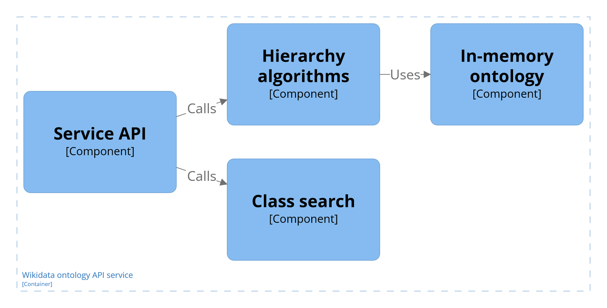

# Wdio API service

The service is an API of the Wikidata ontoloyg.
It loads the preprocessed ontology into a memory and provides access APIs.

- Structure of this readme:
  - Implementation
  - How to run the service.

# Implementation

Is implemented as Node.js server with Fastify and Typescript.

- The service is devided into four main components:
  1. Service API
  2. In-memory ontology
  3. Hierarchy algorithms
  4. Class search

## Service API With Fastify

- Abstractions are based on `fastify` model.

  - Everything is a plugin.
  - Working with typescript requires typings for routes and augmentations for hooks and decorators ([guide](https://fastify.dev/docs/latest/Reference/TypeScript/)).

- The server is asynchronously started by `fastify` by loading all plugins into `FastifyInstance` inside `app.ts` file.
  - Opon start up `fastify` will initialize the `WdOntology` class by loading the preprocessed ontology into memory.
  - Logging is configured based on dev/prod builds.
    - Internally it uses `pinojs` for logging.
    - During development it uses `pino-pretty`.
    - In production the format is leaner.
- Routes are created as a plugin into `fastify`.
- Each route contains a schema of the route output, that is done in order to increase performance of serialization of the data and to allow typescript in the reply.
  - We are using `json-schema-to-ts` as a means to write json schemas for the routes responses and requests.
  - There are [multiple ways](https://fastify.dev/docs/latest/Reference/TypeScript/) how to do it.
- The API returns `fastify` errors when an unexisting entity is accessed.
  - For more on errors visit [docs](https://fastify.dev/docs/latest/Reference/Errors/).
- Host and ports:
  - For running inside docker, the `host` needs to be set to `0.0.0.0` otherwise the `fastify` will not connect to the outside.
  - During development, it defaults to `localhost`.
  - Port is set to `3042`.

## Ontology

The ontology is represented by the class `WdOntology`.
It loads the preprocessed ontology into a memory and creates API for the `fastify` routes.

- Structure:
  - `entities`
    - Contains Wikidata entities to be loaded from the preprocessed files.
  - `hierarchy-walker`
    - Implements walking of the class hierarchy (parents/children).
    - Enables using extractor for each passed class in the hierarchy.
  - `loading`
    - Loads preprocessed entities into a intermediate format, which is then used for constructing the Wikidata entities.
  - `search`
    - Implements searching based on string.
    - Contains client to the ElasticSearch
  - `surroundings`
    - Implements walking the surroundings.
    - `domains-ranges` - implements extractors and functions for obtaining domains or ranges for a specific class and a property, the class defines the final ordering of the returned properties.
    - `filter-by-instance` - runs the SPARQL query for obtaining filter from an instance.
    - `hierarchy-with-properties` - implements extractor to obtain and sort properties, including inherited, for a specific class.
  - `wd-ontology.ts`
    - Provides API for the `fastify` routes.
    - Provides implementation of simpler methods and composists of all more complex classes (e.g. hierarchy walking and surroundings).
  - `expose-to-fastify.ts`
    - Loads Wikidata ontology as a plugin into `fastify`.

### In-memory ontology

- The ontology is loaded into memory from a file upon startup of the node.js process.
- The loading is implemented inside `./src/ontology/loading` folder.
  - The folder contains the loading function and special entities that represent entities inside the preprocessed files. The special entities are then used in constructors of the final entities inside the ontology (folder `./src/ontology/entities`).
  - Process:
    1. The preprocessed files are read line by line, each time parsing an entity from the line and mapping it into the special entity type.
    2. The newly mapped entity is then passed to a construtor for the final entity.
       - This serves as a possibility to exclude some information from the preprocessed files.
    3. The final entity is stored inside a map to be accessed when dereferencing an entity id.
       - During loading, we use static constants for empty fields of the entities, to reduce memory footprint.

 

The ontology is comprised of classes and properties.
Each entity has its own map for dereferencing entity ids.
For properties right now we do not store any constraints except the merged usage statistics with property constraints - since they are used in the hierarchy algorithms.

### Hierarchy algorithms

- The hierarchy algorithms are based on walking the subclass of hierarchy of classes.
- Class hierarchy
  - The main algorithm is inside `hierarchy-walker` folder.
    - It enables to provide an extractor which is passed each passed class during the hierarchy walk.
    - It defaults to obtaining parent/children classes.
- Surroundings
  - Implementation of obtaining surroundings of an entity. Mostly used for class surroundings, which obtains available properties and parent hierarchy.
  - `hierarchy-with-properties`
    - Implements extractor for obtaining all properties from a class (including its hierarchy).
    - The extractor sorts the properties based on the score from preprocessing.
  - `one-distance-desc`
    - Implements surroundings of an entity in one distance (one edge step).
    - For a class it obtains available properties and subclasses.
    - For a property it obtains related properties and domains and ranges.
  - `domains-ranges`
    - Implements methods for obtaining domains and ranges for a property and a class.
    - Given a class and a property, the implementation returns all domains/ranges for a property, sorted based on the scores from the class.
      - Meaning if the property has ranges inside the class `subjectOf`/`valueOf` fields, the ranges are used as a priority and then the rest of the domains/ranges are used.
  - `filter-by-instance`
    - Provided with instance URI of a Wikidata entity. It obtains properties and their ranges, which can be used as a filter for surroundings.
    - Assuming the entity is instance and not a class (with the class it would never finish the query).

### Search

- Seach contains Elastic search client and Wikidata client.
- Search process:

  1. Search class obtains the query.
  2. Search class queries Elastic search and Wikidata Actions API.
  3. The results are merged:
     - Results from Wikdiata Action API are checked if they are classes.
     - If they are classes, they will be returned to the client, if not they are discarded.
     - The results are then concatenated with the results from the Elastic search.

- This was done in order to obtain priority from Wikidata itself, while keeping the returned classes consistent with the ontology.

# How to run the service.

## Requirements and installing

- Node.js v20 and above
- To install dependencies: `npm run install`
- Assuming there is running Elastic search service (read below about `.env` and docker images).
- Memory:
  - The service for about 4M classes and 11K properties requires at least 3.2 GB.

## Input files, .env and running during development

The input is handled via `.env` file.

    ES_NODE='https://localhost:9200'
    ES_PASSWD='password'
    ES_CERT_PATH='absolute/path/to/http_ca.crt'
    CLASSES_PATH='absolute/path/to/preprocessed/classes/file.json'
    PROPERTIES_PATH='absolute/path/to/preprocessed/properties/file.json'

- The service expects two files from preprocessing phase `CLASSES_PATH` and `PROPERTIES_PATH` in json format.
  - The files should be output from the 5. phase (Property recommendations).
- `ES_*` contain access information to the Elastic search instance. Assuming we are running Elastic in docker.

  1. `ES_PASSWD` - a password of the elastic search instance provided with certificate
  2. `ES_CERT_PATH` a path to elastic search cerficate
  3. `ES_URL` - an url to elastic search instance

- How to obtain the values:
  - [docker tutorial](https://www.elastic.co/guide/en/elasticsearch/reference/current/docker.html)
  - Since we are not using Kibana, it is enough to reset the password and copy the certiface out of the image
  - **Do not forget** to add a [docker bridge](https://docs.docker.com/network/drivers/bridge/) (e.g.`--network your_bridge`) to the Elastic container and this service, so you could connect to the wdoi API service via docker bridge dns.

 

> Afte you set the `.env` file you can run the service

    $> npm run start

> or build

    $> npm run dist

## Docker and running in production

- There is a ready `Dockerfile` in the folder and it is set up to run in production mode.
- It asumes that the `CLASSES_PATH`, `PROPERTIES_PATH` and `ES_CERT_PATH` are bound to `/app/input` folder inside docker.
  - The preprocessing files and the Elastic search certificate must be bind to the appropriate files inside the docker.
  - `/app/input/classes.json` == `CLASSES_PATH`
  - `/app/input/properties.json` == `PROPERTIES_PATH`
  - `/app/input/http_ca.crt` == `ES_CERT_PATH`
  - Examples below.
- Docker bridge
  - Since now we are running two separete docker containers (Elastic and this service), we need to connect them via [docker bridge](https://docs.docker.com/network/drivers/bridge/).
    1. create your bridge `docker network create my-bridge`
    2. add to the Elastic container when you start the container by using `--network your_bridge` when running the container
    3. or you can add the `bridge` to the running Elastic container via `docker network connect your_bridge elastic_name` ([guide](https://docs.docker.com/reference/cli/docker/network/connect/))
    4. add the same option to this service `--network your_bridge`
- Enviroments
  - `ES_NODE` needs to be URL of the elastic instance, when you used the `bridge`, the instance will be accessible via its container name from within the container. E.g. `https://elastic:9200`.
  - `ES_PASSWD` needs to be the password for the elastic instance.
- Ports and hosts
  - `fastify` needs to set the `host` to `0.0.0.0` in order to work with the docker.
  - `port` is set to run on `3042` as in development.

> Building the image

    $> docker build -t wdoi_image .

> Running the container (adjust the bridge, the password and the paths)

    docker run --network your_bridge \
    -p 3042:3042 \
    -e ES_NODE="https://elastic:9200" \
    -e ES_PASSWD="your_password_here" \
    --mount type=bind,source=/path/to/ds-wdoi/source/preprocessing/classes-recs.json,target=/app/input/classes.json,readonly \
    --mount type=bind,source=/path/to/ds-wdoi/source/preprocessing/properties-recs.json,target=/app/input/properties.json,readonly \
    --mount type=bind,source=/path/to/http_ca.crt,target=/app/input/http_ca.crt,readonly \
    --name wdoi_service wdoi_image

## Routes and swagger

- In development mode, upon startup of the service, there will be generated `swagger.yaml` file into the current folder.
- In both development and production mode, the swagger is served as a static page from the route `/documentation`.

## Why separate containers

- It would be nice if we could run it by docker compose, but right now, there is not a straightforward way to achieve it.
  - We need to update the indices in the elastic, while this is happening this service should be down.
  - After the indices are update, ther would be need to restart this service.
