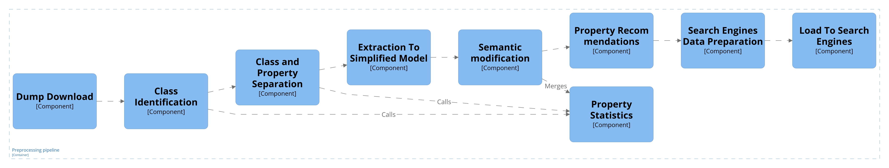

# Preprocessing

This section is divided into three parts:
  1. Summary of the pipeline
  2. How to run the pipeline
  3. Notes on file output formats

# Summary of the pipeline



The preprocessing is done in 8 phases.:

1. Download
2. Identification 
   - The first pass of the dump .
     - Identification of classes and properties.
     - *Property usage statistics*
        - Store instance of values for each entity in the dump for further processing.
3. Separation
   -  She second pass of the dump.
      -  Separation of classes and properties from the dump into two new files preserving the Wikidata data model.
      -  *Property usage statistics*
           - Store property usage for domain and range of classes.
           - Compute summary from the stored property usage for each class and property.   
4. Extraction 
   - The data from separated wikidata classes and properties are extracted into a simplified data model.
5. Modification
   - Semantic and structural modifications are done on the simplified data model.
6. Property Recommendations
   - Merging of recommendations from property usage statistics with property constraints.
   - Boosting "properties for this type" properties.
7. Search Engines Data Preparation
   - Prepares the data that will be loaded into Search engine and appropariate databases (Elastic and Qdrant).
   - Consists of 5 parts:
     1. Reduction of property usage 
         - Enables efficient filtering for classes containing a set of properties.
     2. Expanding to language fields 
         - Expands specified entity ids fields into language fields (e.g. subclass of ids will be expanded to class labels)
         - Essentially needs to iterate over the Wikidata dump again if the fields contain references to entities not present in the ontology.
         - This enables a better lexicalization of entities.
      3. Lexicalize entities
         - Creates lexicalization of entities that will be subsequently vectorized.
      4. Vecorize entities
         - Vectorize the lexicalization of entities into dense and sparse vectors.
      5. Minimization
         - Creates new files containing minimized entities.
         - Since the Search service itself does not need all the data from the preparation phase, this enables a faster start up of the Search service.        
8. Loading to search engine
   - Loads the prepared data into Qdrant database (vector search) and Elastic search (full-text search).

> Note: 
> 1. During 1. and 2. phase, there are running statistics for property usage happening during the dump pases. The statistics run with during 1. and 2. phase to reduce time of the computation.
> 2. The types of property values are not checked, since the Wikidata does not allow to entry value that do not match the property type. Such as: placing a property into subclass of statement.
> 3. I consider only the unique values from extracted properties.
> 4. The output files always contain a single json object on each line representing an entity (a property or a class).
> 5. Output files are created inside `output` directory.

# How to run and use the pipeline

> The running scripts are the same in development and in the conteiners.

The pipeline uses Wikidata JSON dump in the GZIP format.
Each of the main steps mentioned above has its own main script file.
The script file can be run with the provided instructions (below).
There is also a script that is able to run all the phases at once (the bottom of this readme).

## Before running the scippts

- Before running the scripts, read the instructions and preferably comments for each of the phases in `phases` folder.
- The the last phases of the pipeline assumes there are runnig services: Qdrant, Elastic Search, and possibly the Seach service and API service in case the restart is needed - this service can restart the two mentioned services that is equivalent to reloading the new ontology files.
- Read at the end how to run in development and containerization.

### Requirements

- Python 3.11 and above
- Elastic Search 8.13 and above
- Mamory and time
  - The runtimes and memory was measured on virtual infrasctructure with Ubuntu 22 with 64 GB of RAM and 32 core processor.
    - Most of the scripts are single thread, the vectorization uses multiple threads from within the `pytorch` library.
  - Memory
    - Wikidata gzip dump ~ 130 GB (as of 4.4.2024) on disk, depending on the current size.
    - Phases (counting in reserves):
      - The 1. and 2. phase of preprocessing require at least 32 GB of RAM
      - For the rest at least 16 GB
  - Time
    - Downloading depends on the internet connection
      - A university server took ~ 7 hours
    - After downloading
      -  ~ 11 hours to be able to load data into API service.
         -  Mostly linear in execution and hard to parallelize.
      -  ~ 14 hours to prepare the data for loading.
         -  The excessive time comes from the Language models vectorization.
         -  It can be improved with the GPU or more CPUs.

### Installing dependencies

- Ideally use Python virtual enviroment for the scripts.

      $> python -m venv venv
      $> source venv/bin/activate 

- Use frozen `requirements.txt` file to install all dependencies.

      $> python -m pip install -r requirements.txt

### **Logging**:

  - Everything is logged into `log.log` file and console (`std_out`).
  - Errors are also logged separately into `log_errors.log`.
  - Each phase is prefixed with a string identifier.

## Donwloading Wikidata dump (0. phase)

Downloads the newest Wikidata dump in GZIP format, overwriting already existing one.
The main script is `p_download.py`.

- Input:
  - None
  - Example of running:
  
        $> python p_download.py

- Output:
  - A file in the `output` directory.
    - `latest-all.json.gz` - the downloaded Wikidata json dump in GZIP format.

- Logging prefix: `download`

## Identification and separation with statistics (1. and 2. phase)

The part contains 1. and 2. phase with computation of property usage statistics.
The statistics is run during the phases to reduce time of the statistics computation.
The main script is `p_identification_separation.py`.

- Input:
  - A path to the wikidata json dump in the GZIP format.
  - Example of running:
    
        $> python p_identification_separation.py latest-all.json.gz

- Output:
  - Separated classes and propeties files in the `output` directory.
    - `classes.json.gz`
    - `properties.json.gz`
    - Each output file contains an json array where on each line is a Wikidata entity.
    
  - Statistics summaries files in the `output` directory.
    - `classes-property-usage.json`
      - Contains property usage summary for each class with probabilities.
    - `properties-domain-range-usage.json`
      - Contains domain and range statistics for each property with probabilities.

- Logging prefix: `identification_separation`

## Extraction (3. phase)

The part contain 3. phase which is conducted in two steps - class extraction and property extraction.
The phase extracts the data from the Wikidata model into a simplified data model.
The simplified model is simply a flattening of the hierarchical Wikidata model. 
The main script is `p_extraction.py`.

- Input:
  - A required parameter one of `["cls", "props", "both"]`
    - Based on the parameter either the first or the second phase is skipped.
    - For conducting only specific extraction:
      - Classes extraction - use `cls`
      - Properties extraction - use `props`
      - For both extractions - use `both`
  - Required paths to `classes.json.gz` and `properties.json.gz` from previous phase, in the given order.

        $> python p_extraction.py both ./output/classes.json.gz ./output/properties.json.gz

- Output:
  - Files in the `output` directory, containing entities in the new simplified model.
    - `classes-ex.json`
    - `properties-ex.json`

- Logging prefix: `extraction`

## Modification (4. phase)

The phase loads all the data in the new model into memory and does a semantic and structural checking and modification to the entities.
Subsequently, it saves them to two files.
This phase was moved here from server, because this part also takes quite a bit of time (which was unexpected at first).
The main script is `p_modification.py`.

- Input:
  - Required paths to `classes-ex.json`, `properties-ex.json`, `classes-property-usage.json` and `properties-domain-range-usage.json` in the given order, from the 3. phase

        $> python p_modification.py ./output/classes-ex.json ./output/properties-ex.json ./output/classes-property-usage.json ./output/properties-domain-range-usage.json

- Output:
  - Files in the `output` directory, containing the modified classes and properties.
    - `classes-mod.json`
    - `properties-mod.json`

- Logging prefix: `modification`

## Precomputing recommendations (5. phase)

A phase that enables to change property orderings on classes.
So far only boosting of properties from `properties_for_this_type` field and merging property constraints to property usage statistics.
The largest part of the recommendation phase is done in the 2. phase when finilazing property usage statistics and merging the statistics in the modification phase.
The main script is `p_property_recommendations.py`.

- Input:
  - Required paths to `classes-mod.json` and `properties-mod.json` in the given order from the fourth phase.

        $> python p_property_recommendations.py ./output/classes-mod.json ./output/properties-mod.json

- Output:
  - Files in the `output` directory, containing the merged and reordered domains/ranges of classes and properties.
    - `classes-recs.json`
    - `properties-recs.json`

- Logging prefix: `property_recommendations`

## (DEPRECATED) Loading into search service (6. phase)

The phase loads labels and aliases into a search service - elastic search. 
Assuming the Elastic search runs on client from `utils.elastic_search.py`.
Before running this phase, create the indeces using `helper_scripts` functions.
The main script is `p_loading.py`.

- Inputs:
  - Paths to the two files generated in the previous step - `classes-recs.json` and `properties-recs.json`.

        $> python p_loading.py classes-recs.json properties-recs.json

- Outputs:
  - None.

- Logging prefix: `loading`

### Helper scripts

This phase contains helper scipt `p_loading_es_helpers.py`
It either creates, refreshes or deletes classes and properties indices.

- Usage:

      # Creating indices
      $> python loading_es_helpers.py create

      # Deleting everything
      $> python loading_es_helpers.py delete

      # Refreshing the indices
      $> python loading_es_helpers.py refresh

      # Searching the class/property index
      $> python loading_es_helpers.py search_classes "query string goes here"
      $> python loading_es_helpers.py search_properties "query string goes here"

      # Listing indices
      $> python loading_es_helpers.py list

      # List mappings of indices
      $> python loading_es_helpers.py mappings

      # List index sizes
      $> python loading_es_helpers.py size

- Logging prefix: `es_helpers`


## Search engine data preparation (6. phase)

The phase prepares the data to be loaded into a Search service and appropriate databases (Qdrant and Elastic search).
Assuming there are running Qdrant and Elastic search services.
The main script is `p_experimental_search_engine_data_preparation.py`.

- Input:
  - A required `phase` parameter.
    - Each phase represents a part of the preparation.
    - Phases: `["all", "reduce", "expand", "lexicalize", "vectorize", "minimize"]`
    - `all` essentially runs all the parts.
    - Each phase is dependent on the previous one. Order is as given in the phases array above (except the `all` phase).
  - Required file paths `classJsonFile` and `propertiesJsonFile` to the preprocessed files from 5. phase (`recs` phase).
  - A required file path `gzipDumpFile` to the Wikidata GZIP json dump. Needed for expanding to langauge fields phase. 

          &> python p_experimental_search_engine_data_preparation all ./output/classes-recs.json ./output/properties-recs.json ./latest-all.json.gz

- Output:
  - For each phase, there is a set of output files in the `output` directory.
    - All files start with a prefix `(properties|clases)-experimental-prep-` followed by the number of the phase and its name (the same as in the phases array above).

- Logging prefix: `experimental_search_engine_data_preparation`

## Loading to search engines (7. phase)

The phase loads the prepared data to Elastic search and Qdrant database.
The main script is `p_experimental_search_engine_loading.py`.

- Input:
  - A required `phase` parameter.
    - Each phase represents the loading to the database.
    - Phases: `["elastic", "qdrant", "both"]`
    - `both` meaning to load to both Elastic search and Qdrant.
  - Required file paths `classesJsonFile` and `propertiesJsonFile` to the `vectorize` phase output.
  - A required file path `expandedLabelsJsonFile` to the `expand` phase output.
    - To enable modification of the data passed to Elastic. 

        &> python p_experimental_search_engine_loading both ./output/classes-experimental-prep-4-vectorize.json ./output/properties-experimental-prep-4-vectorize.json ./output/classes-experimental-prep-2-expand

- Output:
  - None 

- Logging prefix: `experimental_search_engine_loading`

### Helpers

The phase also contains a script `p_experimental_search_engine_loading_helpers.py` for easier monitoring and working with the Databases. 

- Usage:

      # Get Qdrant collections status
      $> python p_experimental_search_engine_loading_helpers.py qdrant_info

      # Delete all Qdrant collections
      $> python p_experimental_search_engine_loading_helpers.py qdrant_delete

      # Create Elastic indices
      $> python p_experimental_search_engine_loading_helpers.py es_create

      # Delete all Elastic indices
      $> python p_experimental_search_engine_loading_helpers.py es_delete

      # Refreshing Elastic indices
      $> python p_experimental_search_engine_loading_helpers.py es_refresh

      # Listing Elastic indices
      $> python p_experimental_search_engine_loading_helpers.py es_list

      # List Elastic mappings of indices
      $> python p_experimental_search_engine_loading_helpers.py es_mappings

      # List Elastic indices sizes
      $> python p_experimental_search_engine_loading_helpers.py es_size

## Additional scripts

### Restart the Wikidata ontology API service or the Wikidata Search service

The scripts are `p_restart_api_service.py` and `p_restart_search_service.py`.
They restart the Wikidata API/Search service in order to load the new preprocessed ontology.

- Input:
  - `--timeout`
    - optional argument specifiying the the waitime before returning error.
    - The restart can take some time, so setting up above 120 seconds is recommended.
    - Defaults to 360 seconds.
  - Running:

        $> python p_restart_api_service.py --timeout 360

        $> python p_restart_search_service.py --timeout 360

- Output:
  - None

- Logging prefix: `restart_service`

### Run all script

The script runs all phases.
The main file is `p_run_all_phases.py`.
If you need more fine-grained approach, use the specific scripts.

- Input:
  - Optional boolean flag argument whether to donwload the newest dump.
    - `--donwload`
    - Defaults to `False`
    - The `True` will **overwrite the existing dump** in the current folder.
    - It is expected that the GZIP dump file is located in the `output` directory if downloading is disabled. 
  - Optional boolean flag argument whether to restart the API service.
    - `--restart`
    - Defaults to `False`.
  - Optional argument to continue from a specific phase.
    - `--continue-from` `[id_sep | ext | mod | recs | prep | load]`
    - Each value represents a phase based on the output files suffixes.
    - The preprocessing will continue from the given phase.
    - If the argument is used, the download flag is disregarded.
  - Optional flag to exclude the loading into the Elastic search and Qdrant.
    - `--no-load`

## Notes on the file output formats

- We use json format for storing entity information.
- Every json file contain a single entity on a single line in the file.
  - Thus to obtain an entity, it is enough to read line of the file the entity is present on.
- The output entities from phases, except the 2. phase, follow the format denoted in the `core/model_simplified` folder.
- Instead of storing references to objects, the fields that reference other entity store only an id of the entity.
  - It is necessary to create a map/dictionary of the entities to follow the identifiers to the appropriate entities.

## Running in development

- Elastic search set up:
  - Assuming we are running on [Elastic docker image](https://www.elastic.co/guide/en/elasticsearch/reference/current/docker.html).
- Qdrant set up:
  - Assuming we are running on [Qdrant docker image](https://qdrant.tech/documentation/guides/installation/#docker)
- We are running with security disabled.
- It is enought to run the `docker-compose.dev.yml` in the parent `source` folder. 

- The application assumes environment varibles inside `.env` file.
  1. `ES_NODE` an url to Elastic search instance.
  2. `API_SERVICE_RESTART` an url path to the restart API of the Wikidata ontology API service.
  3. `API_SERVICE_RESTART_KEY` a key used to restart the Wikidata ontology api service.
  4. `QDRANT_NODE` an url to the Qdrant database.
  5. `SEARCH_SERVICE_RESTART` an url path to the restart API of the Wikidata Search service.
  6. `SEARCH_SERVICE_RESTART_KEY` a key used to restart the Wikidata Search service.
  7. `HUGGIN_FACE_TOKEN` a token to the Huggin face account to enable access of the gated models.

Then you can run the scripts with the above mentioned methods.

## Containerization and running in production

The problem with the containerization is that the preprocessing is not running all the time and that the Wikidata ontology API service needs to restart to load the new data.
In development, it is easy.

- Docker image structure:
  - `/app` contains the copied and installed packages and code files.
  - `/app/output` is expected to bind the host's `/preprocessing/output` directory to enable storing and sharing of the files.
- The docker image itself is not running any command. It is expected that the container is started via `docker run` starting `bash` and specifying a network bridge which enables communiation with the rest of the unpublished services. Then you can start the scripts from within the container and restart/reload services.
- Environments:
  - The environments must match the `.env` variable names. Assuming they are set via `-e` option in `docker run`.
  - All the URLs must match the service names in the bridge network to enable communtation with the unpublished services.
- Follow the `docker-compose.yml` in the parent `source` folder.
  - The host names are the names of the services - e.g. `api` and `elastic`

> Building the image.

    $> docker build -t prep .

> Example of running after build.
```
    $> sudo docker run --rm \
    -it \
    --network your_bridge \
    -e ES_NODE="http://elastic:9200" \
    -e QDRANT_NODE="http://qdrant:6333" \
    -e API_SERVICE_RESTART="http://api:3042/restart" \
    -e API_SERVICE_RESTART_KEY="1234567" \
    -e SEARCH_SERVICE_RESTART="http://search:3062/restart" \
    -e SEARCH_SERVICE_RESTART_KEY="1234567" \
    -e HUGGIN_FACE_TOKEN="abcdefg" \
    --mount type=bind,source=./output,target=/app/output \
    prep /bin/bash
```

